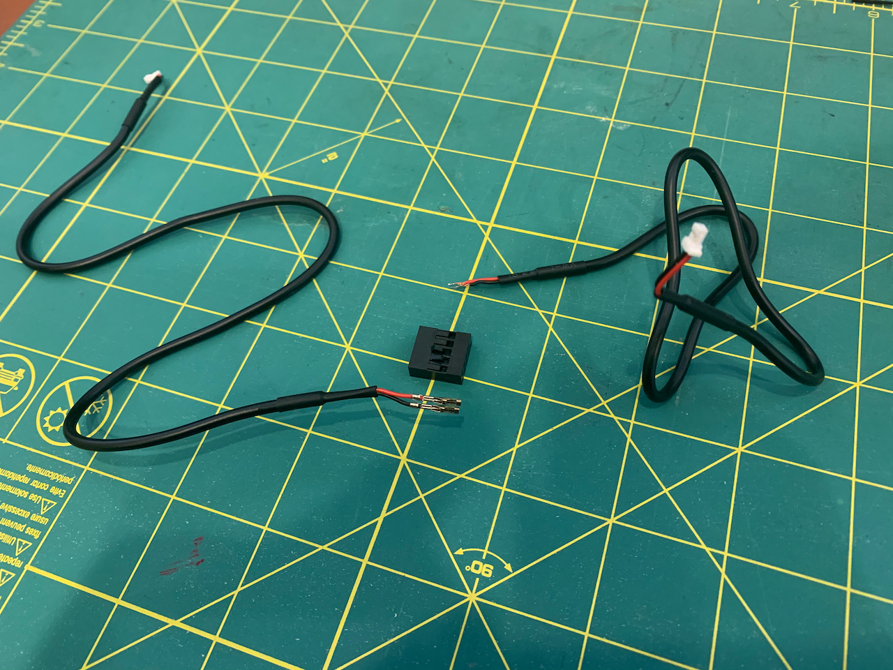
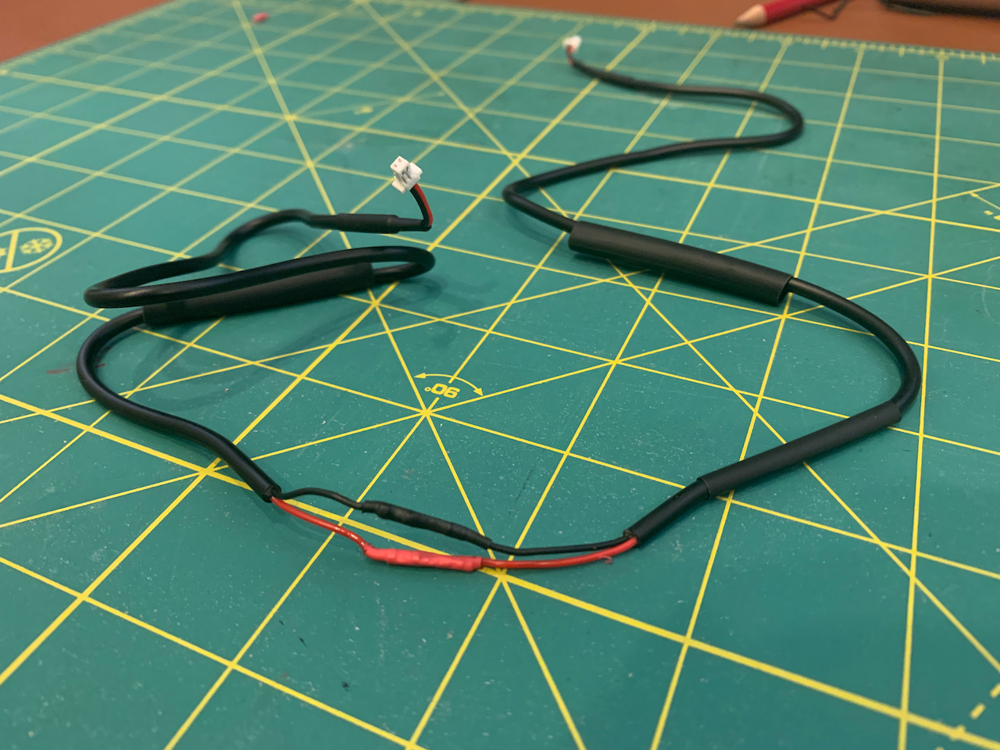
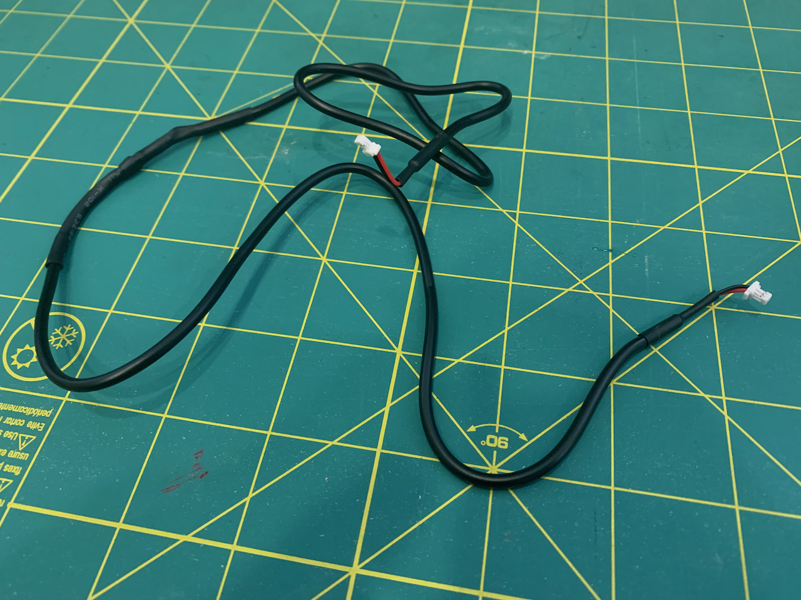
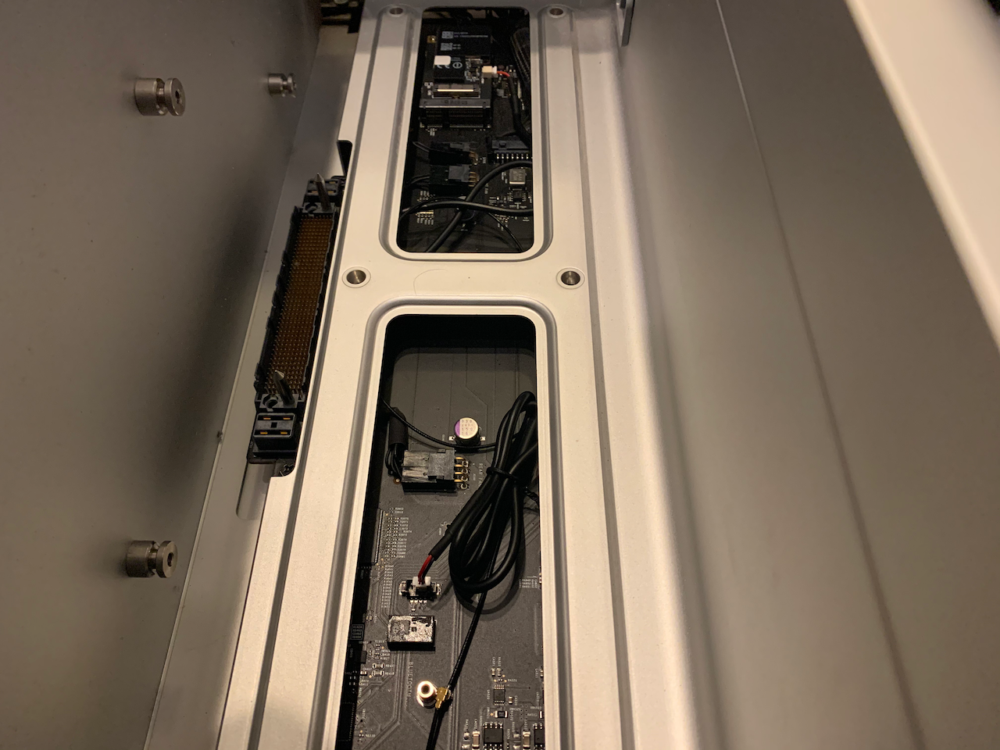
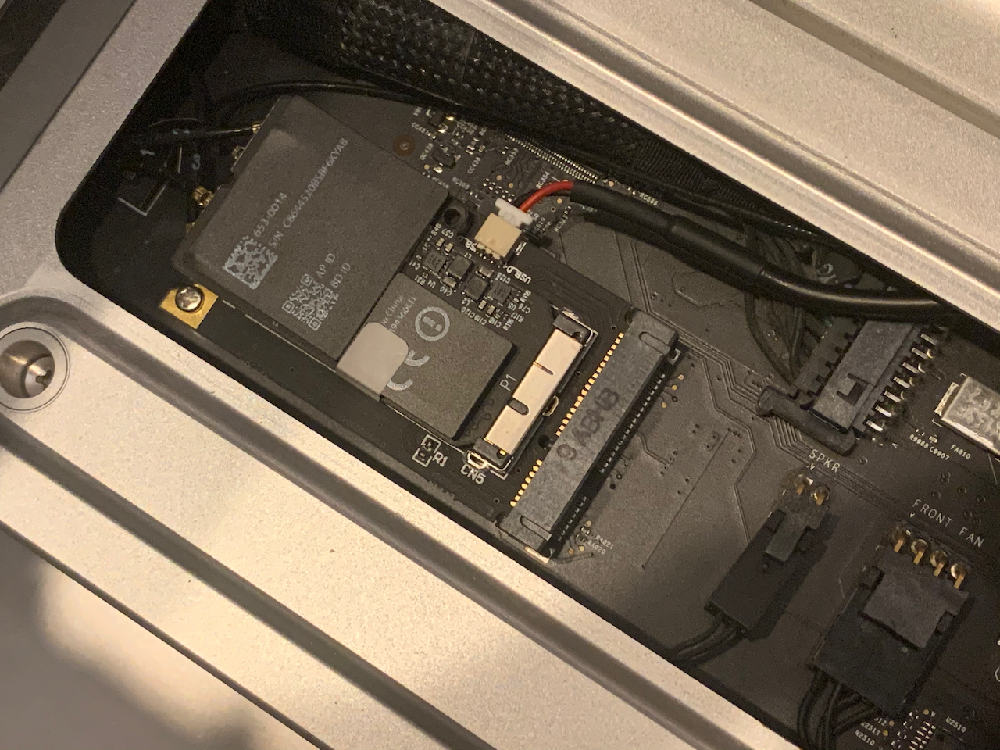

[Home](./README.md) ▸ Bluetooth and Wifi Upgrade

## About my Mac Pro 5,1

My MacPro has the following configurations at the moment:

- Processor:        2 x 3.33 Ghz 6-Core Intel Xeon (X5680)
- Memory:           96 GB 1066 Mhz DDR3 ECC
- Graphics:         AMD Radeon RX 580 8 GB

## My Upgrade Journey

I would highly recommend this upgrade as this will enable faster WiFi AC (5) standard and Bluetooth 4.0 standard.  I used the following part for the upgrade:

- Mini PCI-E Adapter - [Amazon](https://amzn.to/3fDIkWw)
- UFL/u.FL/IPX/IPEX RF Coaxial Extension Cord - [Amazon](https://amzn.to/30nqRet)
- WiFi Bluetooth Card BCM94360CD - [Amazon](https://amzn.to/32vAtXy)

**Difficulty Level:** Easy to Medium

**Time Required:** 30-45 min

**Videos:**

- https://youtu.be/JtjZKfioOHY
- https://youtu.be/d9xPvreK8tg

### Remove the Bluetooth and Wifi Card

Remove any existing bluetooth and Wifi Cards already in the system. You can follow one of the videos to help guide you through that process.

### Create the new data cable wire

To create the data cable wire follow the images below to connect the wires together in the ordered product.

> **Findings:** I would highly recommend that you solder the wires before shrink wrapping them to create good connection. If the data cable are not connected securely then you will notice that the mac pro mouse will not respond as fast as you would expect it to respond.

# Connect Wires to the Wifi card

Here are all the connections that need to be made:

- Data cable from the removed bluetooth module to the Mini PCI-E Adapter
- Bluetooth UFL cord extended using the UFL Coaxial Extension Cord
- UFL Coaxial Extension Cord connected to J3 (some cards it is called A3) on the WiFi Bluetooth Card BCM94360CD
- Wire 1 on the Airport side connected to J1 (some cards it is called A1) on the WiFi Bluetooth Card BCM94360CD
- Wire 2 on the Airport side connected to J2 (some cards it is called A2) on the WiFi Bluetooth Card BCM94360CD
- Wire 3 on the Airport side connected to J0 (some cards it is called A0) on the WiFi Bluetooth Card BCM94360CD
- Mini PCI-E Adapter connected and screwed down in the MacPro
- WiFi Bluetooth Card BCM94360CD with all its connections inserted in the Mini PCI-E Adapter slot

Here is resultant image with the wires tucked off:

Close up image of the WiFi Bluetooth Card BCM94360CD in the Mini PCI-E Adapter:

