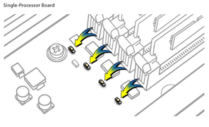
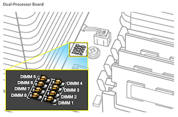

# My MacPro 5,1 Upgrade Journey

This document describes my journey with the Mac Pro (Early 2009), originally a 4,1 flashed to a 5,1. I will ry to include some of my findings and some for people to follow along this journey if they wish to buy a used Mac Pro or upgrade to a working Mac Pro in 2020. This machine still works very well for being 10+ years old. I will try to include as many videos as possible that i have used as a reference (My YouTube playlist is added below). Before we start a quick disclaimer as always. 

> **Disclaimer:** Try the things mentioned in this documentation at your own risk. I do not guaranty that this will work for you but I hope it does. This is purely for educational purposes and I am not responsible for any void in warranty. This is not a end all be all guides. These steps have worked for me but there might be additional steps that might be required for getting things to work on your end. Please follow the links mentioned in the the `Useful Links` section below for more update to date information about the community postings on this topic.

## Contents

- [Purchase](#Purchase)
- [My Upgrade Journey](#My-Upgrade-Journey)
  - [Flashing the 4,1 to make it 5,1](#Flashing-the-4,1-to-make-it-5,1)
  - [CPU Upgrade](#CPU-Upgrade)
  - [RAM Upgrade](#RAM-Upgrade)
  - [GPU Upgrade](#GPU-Upgrade)
  - [Wifi and Bluetooth Upgrade](#Wifi-and-Bluetooth-Upgrade)
  - [Adding Thunderbolt Support](#Adding-Thunderbolt-Support)
- [Other Useful Upgrades](#Other-Useful-Upgrades)
- [Useful Links](#Useful-Links)

## Purchase

If you already have a Mac Pro skip to the next section. Let me go through my buying experience. I saw a posting on Facebook Marketplace for a Mac Pro Early 2009. After a quick and simple negotiation I got it down to $175. Here are some of the images from the post and from the negotiation.

Personally I think that the fare price for this kind of system is below $250.

## My Upgrade Journey

Now this resulted in my upgrade journey starting with a lot of research work! I did lot of the reading and searching online but never new of this fb group [Mac.Pro.Upgrade](https://www.facebook.com/groups/Mac.Pro.Upgrade). I would recommend every one on however far in this journey to join this group.

One thing that has been very helpful throughout this journey is the Mac Pro Technical documentation which can be found [here](./pdfs/Tech Guide - Mac Pro (Mid-2010 ~ Mid-2012).pdf). I will try to point out some of my findings so that folks following along will not have to do the similar research.

### Flashing the 4,1 to make it 5,1

I began by flashing my 4,1 to 5,1 It was a farley simple process. I will link the iFixit Guide [here]()

The steps include:
- Download the Tools & Upgrade to macOS 10.11
- Disable SIP (System Integrity Protection)
- Run the Firmware Upgrade Tool
- Shut Down & Flash

The onscreen tutorial will guide you through this process.

**Difficulty Level:** Easy

**Time Required:** 10-15 min

**Videos:**

- 
- 

### CPU Upgrade

I upgraded to a Intel Xeon 3.33GHz Hex X5680 processor as this is the best value for money processor. The most powerful CPU that can put in this computer in a single or dual configuration is Intel Xeon 3.46GHz X5690. 

- Intel Xeon 3.33GHz Hex X5680 - [Amazon](https://amzn.to/2ZE052n) (Will need to be de-lidded) / [Ebay](https://www.ebay.com/sch/i.html?_from=R40&_trksid=m570.l1313&_nkw=Pair+Delidded+Intel+Xeon+3.33GHz+Hex+X5680&_sacat=0)
- 3 MM allen wrench - [Amazon](https://amzn.to/3fAl4sx)
- Thermal Compound Paste - [Amazon](https://amzn.to/2WyAmql)

If you are upgrading a Mac Pro 2010. Then you don't need to buy de-lidded CPUs.

**Difficulty Level:** Medium to High

**Time Required:** 15-30 min

> **Finding:** Processor screws need to be tighten quite a bit. After if the Mac Pro is not booting keep tightening the screws quarter turn at a time till the system does not boot. Always tighten the screws in a criss cross pattern. The recommended sequence is shown below:

**Videos:**

- https://www.youtube.com/watch?v=xaZAUAXcVYc&list=PLxp0TMbVUXVdJB6w814mdMIXP2C-k_3Tx&index=2&t=0s
- https://youtu.be/9U5R0qyDF3g?t=927
- https://www.youtube.com/watch?v=7O-FQgeaBE8
- https://youtu.be/3sDZXpTP5ww?t=334
- https://youtu.be/3Z2ZSie7zeU?t=308

### RAM Upgrade

I recommend using only 3 out of the 4 chanel's to get the maximum speed out of the Mac Pro using `2Rx4 - 10600R` memory

- (6X 16GB) PC10600 DDR3 ECC-Registered 1333MHz - [Amazon](https://amzn.to/399gXS0) / [Ebay](https://www.ebay.com/itm/96GB-6x16GB-DDR3-1333-ECC-Reg-Memory-for-Apple-Mac-Pro-Mid-2010-5-1-12-Core/303067738681?hash=item46903eb239:g:InMAAOSwCf5ek-uq) (Cheaper)

There are a sequence in which RAM modules needs to be inserted into the slots here is explained in the diagram below:

 
 

**Difficulty Level:** Easy

**Time Required:** 5 min

> **Finding:** Try to fill in 3 channels (6 DIMMs) for maximum performance of your Mac Pro. If any of of memory sticks are faulty you will see the respective LED light up on the CPU Tray. 

 
 

### GPU Upgrade

The GPU that I decided to go with was the RX580. This was the only one at the time that took about 225 Watts of power. This can be supplied by the Mac Pro without any modification and gives decent performance and also allows Mac Pro to run Mojave. I used the following part for the upgrade:

- Sapphire Radeon Pulse RX 580 8GB GDDR5 - [Amazon](https://amzn.to/2Cn8caS)
- Dual Mini 6 Pin to 8 Pin PCI Express Video Card Power Adapter - [Amazon](https://amzn.to/3hcnu0R)

> **Finding:** Once you replace your GPU you will loose your ability to see the boot screen to enter into recovery mode. I would recommend keeping that old GPU around if you ever need it. You can possibly OpenCore your system to get a boot screen. Refer to the Thunderbolt 3 section below to see how you can do that.

**Videos:**

- 
- 

### PCIE SSD Upgrade

I used the following PCIE Card and SSD for my upgrade. This upgrade is similar to adding a Graphic Card into the system refer to the Videos below.

- NVME Adapter with Heat Sink, M.2 SSD Key M to PCI Express Expansion Card - [Amazon](https://amzn.to/2Wvh0Cs)
- Samsung 970 EVO SSD 1TB - [Amazon](https://amzn.to/2ZF5Exv)

**Videos:**

- 
- 

### Wifi and Bluetooth Upgrade

I would highly recommend this upgrade as this will enable faster WiFi AC (5) standard and Bluetooth 4.0 standard. This will allow functionality such as Airdrop and unlock with Apple Watch (Series 3+). I used the following part for the upgrade:

- Mini PCI-E Adapter - [Amazon](https://amzn.to/3fDIkWw)
- UFL/u.FL/IPX/IPEX RF Coaxial Extension Cord - [Amazon](https://amzn.to/30nqRet)
- WiFi Bluetooth Card BCM94360CD - [Amazon](https://amzn.to/32vAtXy)

The bluetooth and the Wifi (AirPort Extreme) Cards can be found in the below.

 
 

My upgrade pictures

**Difficulty Level:** Easy to Medium

**Time Required:** 30-45 min

**Videos:**

- https://youtu.be/JtjZKfioOHY
- 

### Adding Thunderbolt Support

I added Thunderbolt support to my with a Gigabyte GC-Titan Ridge Card a full guide can be found [here](https://github.com/ameyrupji/thunderbolt-macpro-5-1/blob/master/GC-TitanRidge.md)

## Useful Links

- http://blog.greggant.com/posts/2018/05/07/definitive-mac-pro-upgrade-guide.html#thunderbolt
- https://www.facebook.com/groups/Mac.Pro.Upgrade

**Videos**

- https://www.youtube.com/playlist?list=PLxp0TMbVUXVdJB6w814mdMIXP2C-k_3Tx